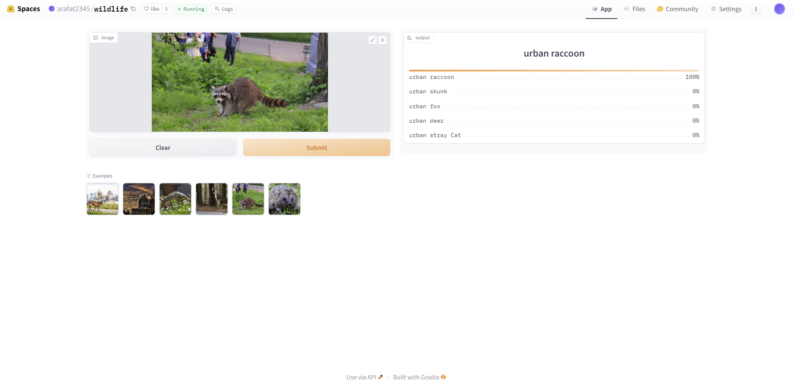

# Wildlife-Identification-in-Urban-Environments
An image classification model from data collection, cleaning, model training, deployment and API integration.  
The model can classify 15 different types of Wildlife in Urban Environments  
The types are following:  
1. urban armadillo
2. urban bat
3. urban bird
4. urban coyote
5. urban deer
6. urban fox
7. urban hedgehog
8. urban opossum
9. urban pigeon
10. urban rabbit
11. urban raccoon
12. urban rat
13. urban skunk
14. urban squirrel
15. urban stray Cat

# Dataset Preparation
**Data Collection:** Downloaded from DuckDuckGo using term name  
**DataLoader:** Used fastai DataBlock API to set up the DataLoader.  
**Data Augmentation:** fastai provides default data augmentation which operates in GPU.  
Details can be found in `notebooks/Wildlife_data_prep.ipynb`

# Training and Data Cleaning
**Training:** Fine-tuned a resnet34 model for 5 epochs (3 times) and got upto 98% accuracy.  
**Data Cleaning:** This part took the highest time. Since I collected data from browser, there were many noises. Also, there were images that contained. I cleaned and updated data using fastai ImageClassifierCleaner. I cleaned the data each time after training or finetuning, except for the last time which was the final iteration of the model.  

# Model Deployment
I deployed to model to HuggingFace Spaces Gradio App. The implementation can be found in `deployment` folder or [here](https://huggingface.co/spaces/arafat2345/wildlife).  

# API integration with GitHub Pages
The deployed model API is integrated [here](https://arafat2345.github.io/Wildlife-Identification-in-Urban-Environments/) in GitHub Pages Website. Implementation and other details can be found in `docs` folder.
